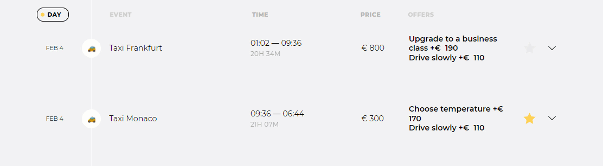
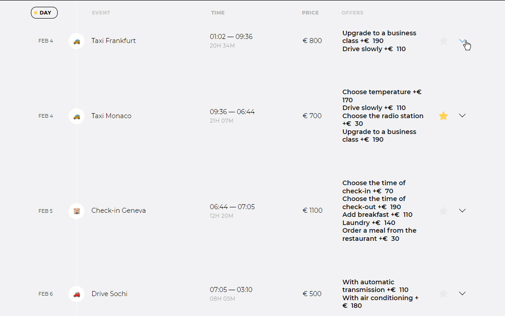
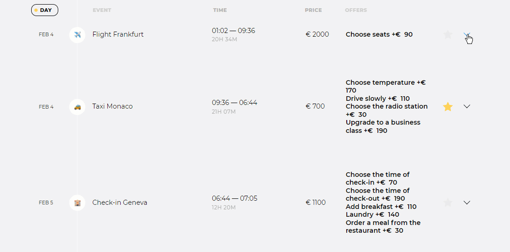
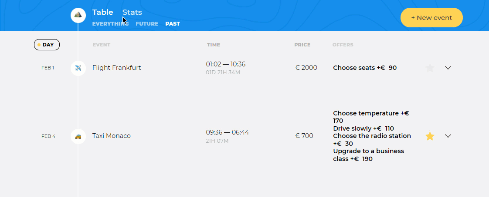
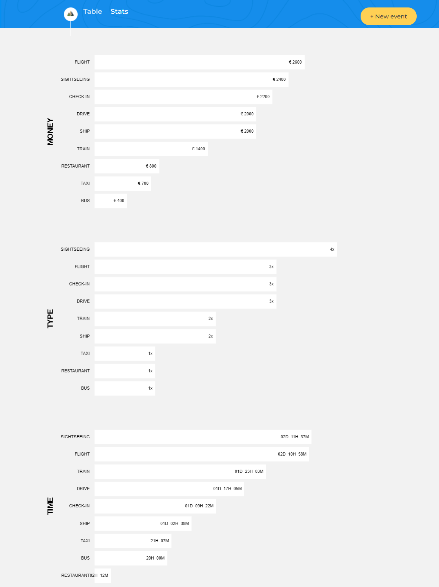
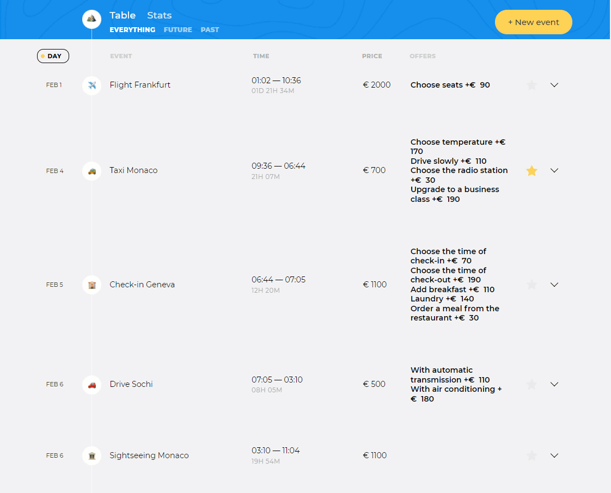

# О проекте
«Большое путешествие» — сервис помогает детально спланировать маршрут поездки, рассчитать стоимость путешествия и получить информацию о достопримечательностях. 

## Как запустить
1. `npm i`
2. `npm run start`

## [Открыть демо](https://k49.ru/big-trip)

## Что было сделано
* Настроена сборка проекта с помощью Webpack
* Настроен сервер для разработки (пакет webpack-dev-server)
* Установлен Babel для того чтобы использовать новые возможности ES6 и была поддержка старых браузеров

### Этапы работы с проектом
* Разбили верстку на компоненты
* Разработали структуру и динамические моковые данные (чтобы не ждать готовность сервера)
* Создали абстрактный класс с общими методами для большей части компонентов
* Создали классы компонентов, которые наследуются от абстрактного класса
* Добавили презентер в проект, задачи которого реализовать поведение проекта (обработчики, датабиндинг, бизнес логика)
* Разработали сортировку

* Реализовали сохранение введнных данных формы и восстановление обработчиков

* Добавлена библиотека Flatpickr для удобной выбора дат а также подключена библиотека dayjs

* Реализован паттерн Observer чтобы реализовать поставление актуальных офферов маршрута при смене типа, а также при фильтрации
* Настроили чтобы Model переключала экрана и делал фильтрацию

* Добавлена библиотека Chart.js чтобы отразить актуальную статистику

* Настроили API применив паттерн адаптер для получения, обновление, удаления, добавления точек маршрута

## Ещё
* Проект от [HTML Academy](https://htmlacademy.ru/), курс [JavaScript. Архитектура клиентских приложений](https://htmlacademy.ru/intensive/ecmascript)
* [Мой профиль в HTML Academy](https://htmlacademy.ru/profile/kalaganov5)
* Наставник: [Александра Яковина](https://htmlacademy.ru/profile/sashayakovyna).
